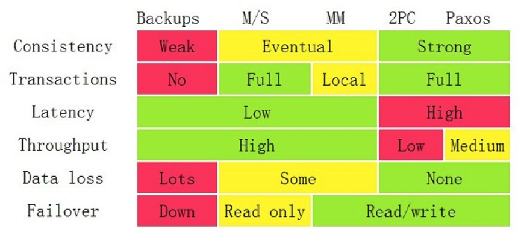

# 分布式系统关键技术：流量与数据调度

一方面，服务治理是内部系统的事，而流量调度可以是内部的，更是外部接入层的事。
另一方面，服务治理是数据中心的事，而流量调度要做得好，应该是数据中心之外的事，也就是我们常说的边缘计算，是应该在类似于 CDN 上完成的事。

所以，流量调度和服务治理是在不同层面上的，不应该混在一起，所以在系统架构上应该把它们分开

**流量调度的主要功能**
- 依据系统运行的情况，自动地进行流量调度，在无需人工干预的情况下，提升整个系统的稳定性
- 让系统应对爆品等突发事件时，在弹性计算扩缩容的较长时间窗口内或底层资源消耗殆尽的情况下，保护系统平稳运行。
- 服务流控。服务发现、服务路由、服务降级、服务熔断、服务保护等。
- 流量控制。负载均衡、流量分配、流量控制、异地灾备（多活）等。
- 流量管理。协议转换、请求校验、数据缓存、数据计算等。

> 第二点：为了提高系统架构的稳定性和高可用性

> 这些都应该是一个 API Gateway 应该做的事

**流量调度的关键技术**

- 高性能。API Gateway 必须使用高性能的技术，所以，也就需要使用高性能的语言。
- 扛流量。要能扛流量，就需要使用集群技术。集群技术的关键点是在集群内的各个结点中共享数据。
  这就需要使用像 Paxos、Raft、Gossip 这样的通讯协议。因为 Gateway 需要部署在广域网上，所以还需要集群的分组技术。
- 业务逻辑。API Gateway 需要有简单的业务逻辑，所以，最好是像 AWS 的 Lambda 服务一样，可以让人注入不同语言的简单业务逻辑。
- 服务化。一个好的 API Gateway 需要能够通过 Admin API 来不停机地管理配置变更的，而不是通过一个.conf 文件来人肉地修改配置。

**状态数据调度**

对于服务调度来说，最难办的就是有状态的服务了。
这里的状态是 State，也就是说，有些服务会保存一些数据，而这些数据是不能丢失的，所以，这些数据是需要随服务一起调度的。

一般来说，我们会通过“转移问题”的方法来让服务变成“无状态的服务”。
也就是说，会把这些有状态的东西存储到第三方服务上，比如 Redis、MySQL、ZooKeeper，或是 NFS、Ceph 的文件系统中

> 因为数据存储结点在 Scale 上比较困难，所以成了一个单点的瓶颈。

**分布式事务一致性的问题**

- 要想让数据有高可用性，就得写多份数据。
- 写多份的问题会导致数据一致性的问题。
- 数据一致性的问题又会引发性能问题。

在解决数据副本间的一致性问题时，我们有一些技术方案。
- Master-Slave 方案。
- Master-Master 方案。
- 两阶段和三阶段提交方案。
- Paxos 方案。

## 状态数据调度小结

- 对于应用层上的分布式事务一致性，只有两阶段提交这样的方式。
- 而底层存储可以解决这个问题的方式是通过一些像 Paxos、Raft 或是 NWR 这样的算法和模型来解决。
- 状态数据调度应该是由分布式存储系统来解决的，这样会更为完美。但是因为数据存储的 Scheme 太多，
  所以，导致我们有各式各样的分布式存储系统，有文件对象的，有关系型数据库的，有 NoSQL 的，有时序数据的，有搜索数据的，有队列的……

总之，我相信状态数据调度应该是在 IaaS 层的数据存储解决的问题，而不是在 PaaS 层或者 SaaS 层来解决的。

在 IaaS 层上解决这个问题, 一般来说有三种方案，  
一种是使用比较廉价的开源产品，如：NFS、Ceph、TiDB、CockroachDB、ElasticSearch、InfluxDB、MySQL Cluster 和 Redis Cluster 之类的；  
另一种是用云计算厂商的方案。  
当然，如果不差钱的话，可以使用更为昂贵的商业网络存储方案。  
