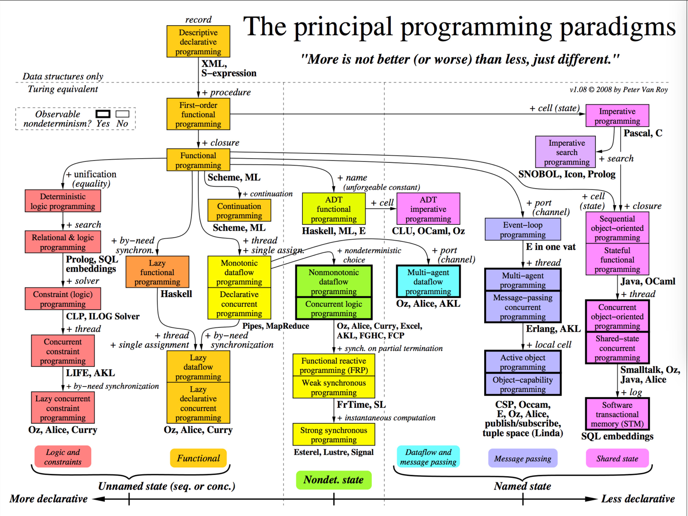
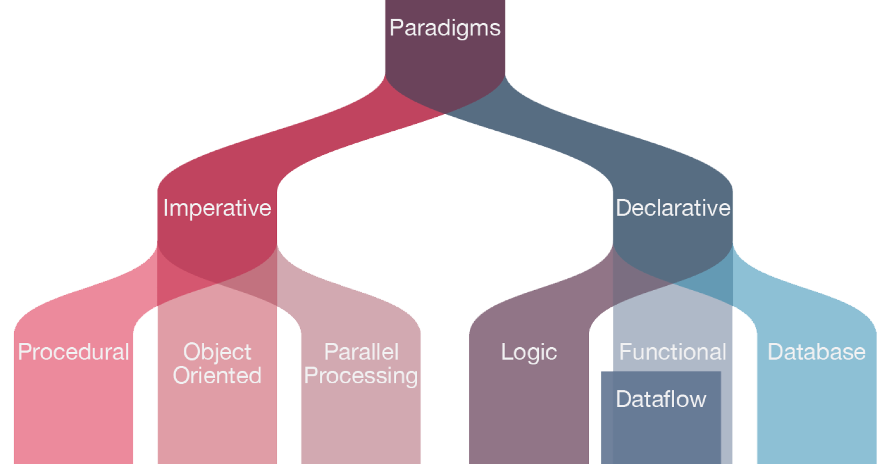

# 编程范式 - 程序世界里的编程范式

[原文](https://time.geekbang.org/column/article/2754)

这个世界到今天有很多很多的编程范式，相当复杂。下面这个图比较好地表现了这些各式各样的编程范式。这个图越往左边就越是“声明式的”，越往右边就越不是“声明式的”（指令式的），我们可以看到，函数式编程、逻辑编程，都在左边，而右边是指令式的，有状态的，有类型的。

我们可以简单地把这世界上纷乱的编程范式，分成这几类：**声明式、命名式、逻辑的、函数式、面向对象的、面向过程的。**

我们再归纳一下，基本上来说，就是两大分支，一边是在解决数据和算法，一边是在解决逻辑和控制。

这世界上四大编程范式的类别，它们的特性和主要的编程语言。

