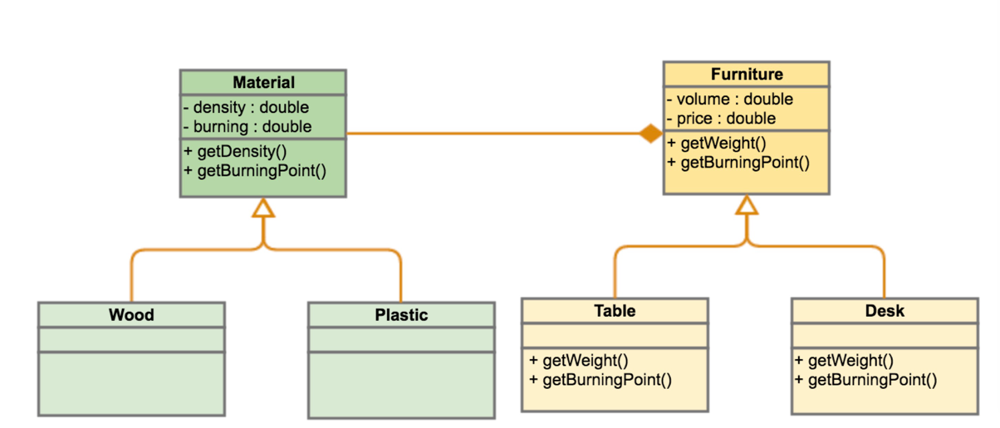

# 编程范式 - 面向对象编程

[原文](https://time.geekbang.org/column/article/2729)

面向对象编程”（Object-oriented programming，缩写为 OOP）

**面向对象的编程有三大特性：封装、继承和多态**

面向对象编程是种具有对象概念的程序编程范型，同时也是一种程序开发的抽象方针。它可能包含数据、属性、代码与方法。对象则指的是类的实例。它将对象作为程序的基本单元，将程序和数据封装其中，以提高软件的可重用性、灵活性和可扩展性，对象里的程序可以访问及修改对象相关联的数据。在面向对象编程里，计算机程序会被设计成彼此相关的对象。

面向对象程序设计可以看作一种在程序中包含各种独立而又互相调用的对象的思想，这与传统的思想刚好相反：传统的程序设计主张将程序看作一系列函数的集合，或者直接就是一系列对计算机下达的指令。面向对象程序设计中的每一个对象都应该能够接受数据、处理数据并将数据传达给其它对象，因此它们都可以被看作一个小型的“机器”，即对象。

**两个面向对象的核心理念**
1. "Program to an 'interface', not an 'implementation'."
  - 使用者不需要知道数据类型、结构、算法的细节。
  - 使用者不需要知道实现细节，只需要知道提供的接口。
  - 利于抽象、封装、动态绑定、多态。
  - 符合面向对象的特质和理念。
2. "Favor 'object composition' over 'class inheritance'."
  - 继承需要给子类暴露一些父类的设计和实现细节。
  - 父类实现的改变会造成子类也需要改变。
  - 我们以为继承主要是为了代码重用，但实际上在子类中需要重新实现很多父类的方法。
  - 继承更多的应该是为了多态。

**拼装对象**
假设我们有如下的描述：
- 四个物体：木头桌子、木头椅子、塑料桌子、塑料椅子
- 四个属性：燃点、密度、价格、重量
那么，我们怎么用面向对象的方式来设计我们的类呢？

这个模式也表现了面向对象的拼装数据的另一个精髓——喜欢组合，而不是继承。这个模式在设计模式里叫“桥接模式”。

和函数式编程来比较，函数式强调于动词，而面向对象强调于名词，面向对象更多的关注于接口间的关系，而通过多态来适配不同的具体实现。

**拼装功能**
处理订单，处理订单有一个关键的动作就是计算订单的价格。有的订单需要打折，有的则不打折。

把订价策略和订单处理的流程分开了。这么做的好处是，我们可以随时给不同的商品注入不同的价格计算策略，这样一来就有很高的灵活度了。剩下的事就交给我们的运营人员来配置不同的商品使用什么样的价格计算的策略了。

这个设计模式叫——策略模式。我认为，这是设计模式中最为经典的模式了，其充分体现了面向对象编程的方式。

**面向对象**
- 我们使用接口抽象了具体的实现类。
- 然后其它类耦合的是接口而不是实现类。这就是多态，其增加了程序的可扩展性。
- 因为这就是接口编程，所谓接口也就是一种“协议”，就像 HTTP 协议一样。浏览器和后端的程序都依赖于这一种协议，而不是具体实现（如果是依赖具体实现，那么浏览器就要依赖后端的编程语言或中间件了，这就太恶心了）。于是，浏览器和后端的程序就完全解开依赖关系，而去依赖于一个标准的协议。
- 这就是面向对象的编程范式的精髓！同样也是 IoC/DIP（控制反转 / 依赖倒置）的本质。

## IoC 控制反转

## 小结

**优点**
- 能和真实的世界交相辉映，符合人的直觉。
- 面向对象和数据库模型设计类型，更多地关注对象间的模型设计。
- 强调于“名词”而不是“动词”，更多地关注对象和对象间的接口。
- 根据业务的特征形成一个个高内聚的对象，有效地分离了抽象和具体实现，增强了可重用性和可扩展性。
- 拥有大量非常优秀的设计原则和设计模式。
- S.O.L.I.D（单一功能、开闭原则、里氏替换、接口隔离以及依赖反转，是面向对象设计的五个基本原则）、IoC/DIP……

**缺点**
- 代码都需要附着在一个类上，从一侧面上说，其鼓励了类型。
- 代码需要通过对象来达到抽象的效果，导致了相当厚重的“代码粘合层”。
- 因为太多的封装以及对状态的鼓励，导致了大量不透明并在并发下出现很多问题。
