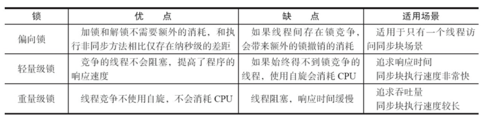
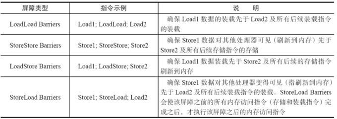

# 并发

并发编程中，
两个核心: JMM内存模型和happens-before规则
三个性质: 原子性、有序性、可见性

## 基础知识

### 并发编程的优缺点

1. 为什么要用到并发,其优势是什么
2. 并发编程的缺点
3. 易混淆的概念

**优点**  
- 充分利用多核CPU计算能力
- 方便进行业务拆分，提升应用性能

**缺点**  
- 频繁的上下文切换
  1. 无锁并发编程: 可以参照ConcurrentHashMap锁分段的思想，不同的线程处理不同段的数据，这样在多线程竞争的条件下，可以减少上下文切换的时间
  2. CAS算法: 乐观锁 Atomic
  3. 使用最少线程: 避免创建不需要的线程，如果线程过多会造成大量线程处于等待状态
  4. 协程: 在单线程里实现多任务的调度，并在单线程里维持多个任务间的切换
- 线程安全: 多线程编程最难把握的就是临界区线程安全问题，稍微不注意就会出现死锁，一旦产生死锁系统就不可用
  1. 避免一个线程同时获得多个锁
  2. 避免一个线程在锁内部占用多个资源，尽量保证每个锁只占用一个资源
  3. 尝试使用定时锁，使用lock.tryLock(timeOut)，当超时时当前线程不会阻塞
  4. 对于数据库锁，加锁和解锁必须在一个数据库连接里，否则会出现解锁失败的情况

同步VS异步  
并发VS并行  
  - 并发指的是多个任务交替进行
  - 并行则是指真正意义上的“同时进行”

阻塞和非阻塞  
临界区  
  - 用来表示一种公共资源或者说是共享数据，可以被多个线程使用。但是每个线程使用时，一旦临界区资源被一个线程占有，那么其他线程必须等待

> Lmbench3测量上下文切换的时长 vmstat测量上下文切换次数

### 线程的状态和基本操作

1. 如何创建线程
2. 线程状态的转换
3. 线程的基本操作
4. 守护线程Daemon

**创建线程**

- 通过继承Thread类，重写run方法
- 通过实现Runable接口
- 通过Callable接口(线程池)

**线程基本操作**

***interrupted***

中断可以理解为线程的一个标志位，它表示了一个运行中的线程是否被其他线程进行了中断操作。  
中断好比其他线程对该线程打了一个招呼。其他线程可以调用该线程的interrupt()方法对其进行中断操作  
同时该线程可以调用isInterrupted()来感知其他线程对其自身的中断操作，从而做出响应  
另外，同样可以调用Thread的静态方法interrupted()对当前线程进行中断操作，该方法会清除中断标志位  

> 当抛出InterruptedException时候，会清除中断标志位，也就是说在调用isInterrupted会返回false

***join***

join方法可以看做是线程间协作的一种方式  
如果一个线程实例A执行了threadB.join(),其含义是: 当前线程A会等待threadB线程终止后threadA才会继续执行  

***sleep***

让当前线程按照指定的时间休眠，其休眠时间的精度取决于处理器的计时器和调度器  
如果当前线程获得了锁，sleep方法并不会失去锁

***sleep() VS wait()***

- sleep()方法是Thread的静态方法，而wait是Object实例方法
- 使用wait()必须在同步方法或同步快中调用，必须获得对象锁。而sleep()没有这个限制。
  wait()会释放占用的对象锁，sleep方法并不会失去锁，只会让出CPU
- sleep()方法在休眠时间达到后如果再次获得CPU时间片就会继续执行，而wait()方法必须等待Object.notift/Object.notifyAll通知后，
  才会离开等待池，并且再次获得CPU时间片才会继续执行

***yield***

当前线程让出CPU，让出的CPU并不是代表当前线程不再运行了，如果在下一次竞争中，又获得了CPU时间片当前线程依然会继续运行。  
另外，让出的时间片只会分配 **给当前线程相同优先级** 的线程

**守护线程Daemon**

守护线程是一种特殊的线程，它是系统的守护者。  
与之对应的就是用户线程，用户线程就可以认为是系统的工作线程，它会完成整个系统的业务操作。  
用户线程完全结束后就意味着整个系统的业务任务全部结束了，因此系统就没有对象需要守护的了，守护线程自然而然就会退。  
当一个Java应用，只有守护线程的时候，虚拟机就会自然退出

> 设置守护线程要先于start()方法

## 并发理论

### Java 内存模型以及happens-before规则

1. JMM内存结构
2. 重排序
3. happens-before规则

> 线程安全的问题一般是因为 **主内存和工作内存数据不一致性** 和 **重排序** 导致的

**并发编程中需要解决的问题**
- 线程之间如何通信，线程之间如何交换信息(共享内存(隐式)、消息传递(通知机制 显式))
- 线程之间如何同步

> Java内存模型是共享内存的并发模型

**共享变量**
实例域、静态域和数组元素都存放于堆中(所有线程都能访问，是可以共享的)  
局部变量、方法定义参数和异常处理器参数不会再线程间共享  

> 共享数据会出现线程安全问题，而不共享数据不会出现线程安全问题

**重排序**

> 在不改变程序执行结果的前提下，尽可能提高并行度

重排序分为以下三种:
- 编译器优化重排序。编译器在不改变单线程程序语义的前提下，可以重排序语句的执行顺序；
- 指令级并行重排序。现代处理器采用了指令级并行技术来将多条指令重叠执行。如果不存在数据依赖性，处理器可以改变语句对应机器指令的执行顺序；
- 内存系统重排序。由于处理器使用缓存和读/写缓冲区，这使得加载和存储操作看上去可能是在乱序执行的；

> 经过以上三种重排序后，就是最终执行的指令序列

> 一个经典例子是DCL(Double Check Lock 双重检查加锁)问题

针对编译器重排序，JMM的编译器重排序规则会禁止一些特定类型的编译器重排序  
针对处理器重排序，编译器在生成指令序列的时候会通过插入内存屏障指令来禁止某些特殊的处理器重排序

**重排序原则**
编译器和处理器在重排序时，会遵守数据依赖性，编译器和处理器不会改变存在数据依赖性关系的两个操作的执行顺序  
即as-if-serial语义，单线程程序的执行结果不能被改变

> as-if-serial语义使程序员不必担心单线程中重排序的问题干扰他们，也无需担心内存可见性问题

**happens-before规则**
JSR-133使用happens-before的概念来指定两个操作之间的执行顺序  
JMM通过happens-before关系向程序员提供跨线程的内存可见性保证

happens-before定义:
1. 如果一个操作happens-before另一个操作，那么第一个操作的执行结果将对第二个操作可见，而且第一个操作的执行顺序排在第二个操作之前
2. 两个操作之间存在happens-before关系，并不意味着Java平台的具体实现必须要按照happens-before关系指定的顺序来执行。
   如果重排序之后的执行结果，与按happens-before关系来执行的结果一致，那么这种重排序并不非法(也就是说，JMM允许这种重排序)

>1是JMM对程序员的承诺。2是JMM对编译器和处理器重排序的约束原则
> happens-before关系本质上和as-if-serial语义是一回事

**as-if-serial VS happens-before**
1. as-if-serial语义保证单线程内程序的执行结果不被改变，happens-before关系保证正确同步的多线程程序的执行结果不被改变
2. as-if-serial语义给编写单线程程序的程序员创造了一个幻境: 单线程程序是按程序的顺序来执行的。
   happens-before关系给编写正确同步的多线程程序的程序员创造了一个幻境: 正确同步的多线程程序是按happens-before指定的顺序来执行的。
3. as-if-serial语义和happens-before这么做的目的，都是为了在不改变程序执行结果的前提下，尽可能地提高程序执行的并行度

**JMM为程序员在上层提供了六条规则**
1. 程序顺序规则: 一个线程中的每个操作，happens-before于该线程中的任意后续操作
2. 监视器锁规则: 对一个锁的解锁，happens-before于随后对这个锁的加锁
3. volatile变量规则: 对一个volatile域的写，happens-before于任意后续对这个volatile域的读
4. 传递性: 如果A happens-before B，且B happens-before C，那么A happens-before C
5. start()规则: 如果线程A执行操作ThreadB.start()（启动线程B)，那么A线程的ThreadB.start()操作happens-before于线程B中的任意操作
6. join()规则: 如果线程A执行操作ThreadB.join()并成功返回，那么线程B中的任意操作happens-before于线程A从ThreadB.join()操作成功返回
7. 程序中断规则: 对线程interrupted()方法的调用先行于被中断线程的代码检测到中断时间的发生
8. 对象finalize规则: 一个对象的初始化完成（构造函数执行结束)先行于发生它的finalize()方法的开始

> 在多线程开发时需要从原子性，有序性，可见性三个方面进行考虑

## 并发关键字

### Synchronized

1. 如何使用Synchronized
2. monitor机制
3. Synchronized的happens-before关系
4. Synchronized的内存语义
5. 锁优化
6. 锁升级策略

**使用场景**
> 可以用在方法上和同步代码块上

- 实例方法: 被锁对象 - 类的实例对象
- 静态方法: 被锁对象 - 类对象
- 实例对象: 被锁对象 - 类的实例对象
- class对象: 被锁对象 - 类对象
- 任意实例对象Object: 被锁对象 - 类的实例对象Object

> 如果锁的是类对象的话，尽管new多个实例对象，但他们仍然是属于同一个类依然会被锁住，即线程之间保证同步关系

**对象锁(monitor)机制**
> 同一时刻只有一个线程能够获取到monitor

> 在同一锁程中，线程不需要再次获取同一把锁

> 每个对象拥有一个计数器，当线程获取该对象锁后，计数器就会加一，释放锁后就会将计数器减一

**锁获取和锁释放的内存语义**
释放锁的时候会将值刷新到主内存中，其他线程获取锁时会强制从主内存中获取最新的值

**CAS操作**
synchronized是一种悲观锁策略，即当前线程获取锁的同时也会阻塞其它线程获取该锁  
CAS操作(也称无锁操作)是一种乐观锁策略，她假设所有线程访问共享资源不会出现冲突，使用 **CAS(compare and swap)** 来鉴别冲突，出现冲突则重试

**CAS操作过程**
CAS比较交换的过程可以通俗的理解为CAS(V,O,N)，包含三个值分别为: V 内存地址存放的实际值；O 预期的值（旧值)；N 更新的新值  
当V和O相同时，表示没有被更改过，此时可以把值N赋值给V  
当V和O不相同时，表示有被更改过，此时不能把值N赋值给V，返回V即可  

> CAS的实现需要硬件指令集的支撑，在JDK1.5后虚拟机才可以使用处理器提供的CMPXCHG指令实现

**Synchronized VS CAS**
Synchronized(未优化前)最主要的问题是: 在存在线程竞争的情况下会出现线程阻塞和唤醒锁带来的性能问题，因为这是一种互斥同步（阻塞同步)。
而CAS并不是把线程挂起，当CAS操作失败后会进行一定的尝试，而非进行耗时的挂起唤醒的操作，因此也叫做非阻塞同步。这是两者主要的区别。

**CAS问题**
- ABA问题，因为CAS会检查旧值有没有变化。比如一个旧值A变为了成B，然后再变成A。此时CAS检查是没有变化的，但实际是由变化的。
  解决方案是使用数据库的乐观锁方式，添加一个版本号。Java提供了AtomicStampedReference来解决ABA问题
- 自旋时间过长
- 只能保证一个共享变量的原子操作，当对一个共享变量执行操作时CAS能保证其原子性，如果对多个共享变量进行操作,CAS就不能保证其原子性  
  解决方案是利用对象整合多个共享变量，即一个类中的成员变量就是这几个共享变量。然后将这个对象做CAS操作就可以保证其原子性。  
  atomic中提供了AtomicReference来保证引用对象之间的原子性

**Java对象头**
在同步的时候是获取对象的monitor,即获取到对象的锁。那么对象的锁怎么理解？无非就是类似对对象的一个标志，那么这个标志就是存放在Java对象的对象头  
Java对象头里的Mark Word里默认的存放的对象的Hashcode,分代年龄和锁标记位  

> 锁一共有4种状态，级别从低到高依次是: 无锁状态、偏向锁状态、轻量级锁状态和重量级锁状态

> 锁可以升级但不能降级,这种锁升级却不能降级的策略，目的是为了提高获得锁和释放锁的效率

**偏向锁**

HotSpot的作者经过研究发现，大多数情况下，锁不仅不存在多线程竞争，而且总是由同一线程多次获得，为了让线程获得锁的代价更低而引入了偏向锁  

**偏向锁的获取**
当一个线程访问同步块并获取锁时，会在对象头和栈帧中的锁记录里存储锁偏向的线程ID，以后该线程在进入和退出同步块时不需要进行CAS操作来加锁和解锁，
只需简单地测试一下对象头的Mark Word里是否存储着指向当前线程的偏向锁。如果测试成功，表示线程已经获得了锁。
如果测试失败，则需要再测试一下Mark Word中偏向锁的标识是否设置成1（表示当前是偏向锁): 如果没有设置，则使用CAS竞争锁；
如果设置了，则尝试使用CAS将对象头的偏向锁指向当前线程

**偏向锁的撤销**
偏向锁使用了一种等到竞争出现才释放锁的机制，所以当其他线程尝试竞争偏向锁时，持有偏向锁的线程才会释放锁  
偏向锁的撤销，需要等待全局安全点（在这个时间点上没有正在执行的字节码)  
它会首先暂停拥有偏向锁的线程，然后检查持有偏向锁的线程是否活着，如果线程不处于活动状态，则将对象头设置成无锁状态；
如果线程仍然活着，拥有偏向锁的栈会被执行，遍历偏向对象的锁记录，栈中的锁记录和对象头的Mark Word要么重新偏向于其他线程，
要么恢复到无锁或者标记对象不适合作为偏向锁，最后唤醒暂停的线程

**如何关闭偏向锁**
偏向锁在Java 6和Java 7里是默认启用的，但是它在应用程序启动几秒钟之后才激活，
如有必要可以使用JVM参数来关闭延迟: -XX:BiasedLockingStartupDelay=0。
如果你确定应用程序里所有的锁通常情况下处于竞争状态，可以通过JVM参数关闭偏向锁: -XX:-UseBiasedLocking=false，那么程序默认会进入轻量级锁状态

**轻量级锁**

**加锁**
线程在执行同步块之前，JVM会先在当前线程的栈桢中创建用于存储锁记录的空间，并将对象头中的Mark Word复制到锁记录中，
官方称为Displaced Mark Word。然后线程尝试使用CAS将对象头中的Mark Word替换为指向锁记录的指针。
如果成功，当前线程获得锁，如果失败，表示其他线程竞争锁，当前线程便尝试使用自旋来获取锁。

**解锁**
轻量级解锁时，会使用原子的CAS操作将Displaced Mark Word替换回到对象头，如果成功，则表示没有竞争发生。
如果失败，表示当前锁存在竞争，锁就会膨胀成重量级锁。

### Volatile ['vɒlətaɪl]

1. 实现原理
2. happens-before的关系推导
3. 内存语义
4. 内存语义的实现

> volatile就可以说是java虚拟机提供的最轻量级的同步机制

> 被volatile修饰的变量能够保证每个线程能够获取该变量的最新值，从而避免出现数据脏读的现象。从而保证数据的“可见性”，但不保证原子性

**happens-before**

volatile变量的写，happens-before之后的volatile变量的读

**volatile内存语义**

> 为了性能优化，JMM在不改变正确语义的前提下，会允许编译器和处理器对指令序列进行重排序，那如果想阻止重排序要怎么办了？答案是可以添加内存屏障

**内存屏障**

java编译器会在生成指令系列时在适当的位置会插入内存屏障指令来禁止特定类型的处理器重排序。
为了实现volatile的内存语义，JMM会限制特定类型的编译器和处理器重排序，JMM会针对编译器制定volatile重排序规则表:

"NO"表示禁止重排序。为了实现volatile内存语义时，编译器在生成字节码时，会在指令序列中插入内存屏障来禁止特定类型的处理器重排序。
对于编译器来说，发现一个最优布置来最小化插入屏障的总数几乎是不可能的，为此，JMM采取了保守策略:
- 在每个volatile写操作的前面插入一个StoreStore屏障；
- 在每个volatile写操作的后面插入一个StoreLoad屏障；
- 在每个volatile读操作的后面插入一个LoadLoad屏障；
- 在每个volatile读操作的后面插入一个LoadStore屏障。

需要注意的是: volatile写是在前面和后面分别插入内存屏障，而volatile读操作是在后面插入两个内存屏障

**StoreStore屏障**: 禁止上面的普通写和下面的volatile写重排序；  
**StoreLoad屏障**: 防止上面的volatile写与下面可能有的volatile读/写重排序  
**LoadLoad屏障**: 禁止下面所有的普通读操作和上面的volatile读重排序  
**LoadStore屏障**: 禁止下面所有的普通写操作和上面的volatile读重排序  

### final

1. 如何使用
2. final的重排序规则
3. final实现原理
4. final引用不能从构造函数中“溢出”(this逃逸)

final可以修饰变量，方法和类，用于表示所修饰的内容一旦赋值之后就不会再被改变

> 当程序中其他地方使用该final变量的地方，编译器会直接替换成该变量的值

final:
- final关键字可以用于成员变量、本地变量、方法以及类
- final成员变量必须在声明的时候初始化或者在构造器中初始化，否则就会报编译错误
- 变量值只能赋值一次，如果是引用类型，引用类型里面的属性不受final影响
- 本地变量必须在声明时赋值
- 在匿名类中所有变量都必须是final变量
- final修饰的方法不能被子类重写
- final方法是可以被重载的
- final修饰的类不能被子类继承
- 接口中声明的所有变量本身是final的
- final方法在编译阶段绑定，称为静态绑定(static binding)

不可变类: 创建该类的实例后，该实例的实例变量是不可改变的
- 使用private和final修饰符来修饰该类的成员变量
- 提供带参的构造器用于初始化类的成员变量
- 仅为该类的成员变量提供getter方法，不提供setter方法，因为普通方法无法修改fina修饰的成员变量
- 如果有必要就重写Object类 的hashCode()和equals()方法，应该保证用equals()判断相同的两个对象其Hashcode值也是相等的

**final重排序规则**

基本数据类型:
- final写: 禁止final写与构造方法重排序，即禁止final写重排序到构造方法之外，从而保证该对象对所有线程可见时，该对象的final全部已经初始化过。
- final读: 禁止初次读对象的引用与读该对象包含的final的重排序。
引用数据类型:
  额外增加约束: 禁止在构造函数对一个final修饰的对象的成员的写入与随后将这个被构造的对象的引用赋值给引用变量的重排序

**final实现原理**

**为什么final引用不能从构造函数中“溢出”**

### 三大性质总结: 原子性，有序性，可见性

1. 原子性: synchronized
2. 可见性: synchronized,volatile
3. 有序性: synchronized,volatile

**原子性**
一个操作是不可中断的，要么全部执行成功要么全部执行失败  
java内存模型中定义了8中操作都是原子的，不可再分的  
- lock(锁定): 作用于主内存中的变量，它把一个变量标识为一个线程独占的状态；
- unlock(解锁): 作用于主内存中的变量，它把一个处于锁定状态的变量释放出来，释放后的变量才可以被其他线程锁定
- read(读取): 作用于主内存的变量，它把一个变量的值从主内存传输到线程的工作内存中，以便后面的load动作使用；
- load(载入): 作用于工作内存中的变量，它把read操作从主内存中得到的变量值放入工作内存中的变量副本
- use(使用): 作用于工作内存中的变量，它把工作内存中一个变量的值传递给执行引擎，
  每当虚拟机遇到一个需要使用到变量的值的字节码指令时将会执行这个操作；
- assign(赋值): 作用于工作内存中的变量，它把一个从执行引擎接收到的值赋给工作内存的变量，每当虚拟机遇到一个给变量赋值的字节码指令时执行这个操作
- store(存储): 作用于工作内存的变量，它把工作内存中一个变量的值传送给主内存中以便随后的write操作使用；
- write(操作): 作用于主内存的变量，它把store操作从工作内存中得到的变量的值放入主内存的变量中

> long 和 double 的操作不是原子的

> volatile 并不能保证原子性，synchronized 能保证原子性

如果让volatile保证原子性，必须符合以下两条规则：
- 运算结果并不依赖于变量的当前值，或者能够确保只有一个线程修改变量的值；
- 变量不需要与其他的状态变量共同参与不变约束

> synchronized: 具有原子性，有序性和可见性； volatile：具有有序性和可见性

## Lock体系

### Lock与AbstractQueuedSynchronizer(AQS)

1. Lock和synchronized的比较
2. AQS设计意图
3. 如何使用AQS实现自定义同步组件
4. 可重写的方法
5. AQS提供的模板方法
6. AQS同步队列的数据结构
7. 独占式锁
8. 共享式锁

synchronized同步块执行完成或者遇到异常是锁会自动释放，而lock必须调用unlock()方法释放锁，因此在finally块中释放锁。

### 可重入锁ReentrantLock

1. 重入锁的实现原理
2. 公平锁的实现原理
3. 非公平锁的实现原理
4. 公平锁和非公平锁的比较

### 读写锁ReentrantReadWriteLock

1. 如何表示读写状态
2. WriteLock的获取和释放
3. ReadLock的获取和释放
4. 锁降级策略
5. 生成Condition等待队列
6. 应用场景

### Condition的await和signal等待/通知机制

1. 与Object的wait/notify机制相比具有的特性
2. 与Object的wait/notify相对应的方法
3. 底层数据结构
4. await实现原理
5. signal/signalAll实现原理
6. await和signal/signalAll的结合使用

### LockSupport

1. 主要功能
2. 与synchronized阻塞唤醒相比具有的特色

## 并发容器

### ConcurrentHashMap(JDK 1.8版本)

1. 关键属性
2. 重要内部类
3. 涉及到的CAS操作
4. 构造方法
5. put执行流程
6. get执行流程
7. 扩容机制
8. 用于统计size的方法的执行流程
9. 1.8版本的ConcurrentHashMap与之前版本的比较

### CopyOnWriteArrayList

1. 实现原理
2. COW和ReentrantReadWriteLock的区别
3. 应用场景
4. 为什么具有弱一致性
5. COW的缺点

### ConcurrentLinkedQueue

1. 实现原理
2. 数据结构
3. 核心方法
4. HOPS延迟更新的设计意图

### ThreadLocal

1. 实现原理
2. set方法原理
3. get方法原理
4. remove方法原理
5. ThreadLocalMap

### ThreadLocalMap

1. ThreadLocal内存泄漏原理
2. ThreadLocal的最佳实践
3. 应用场景

### BlockingQueue

1. BlockingQueue的基本操作
2. 常用的BlockingQueue

## 线程池(Executor体系)

### 线程池实现原理

1. 为什么要用到线程池
2. 执行流程
3. 构造器各个参数的意义
4. 如何关闭线程池
5. 如何配置线程池

### ScheduledThreadPoolExecutor

1. 类结构
2. 常用方法
3. ScheduledFutureTask
4. DelayedWorkQueue

### FutureTask基本操作总结

1. FutureTask的几种状态
2. get方法
3. cancel方法
4. 应用场景
5. 实现 Runnable接口

## 原子操作类

### Java中atomic包中的原子操作类总结

1. 实现原理
2. 原子更新基本类型
3. 原子更新数组类型
4. 原子更新引用类型
5. 原子更新字段类型

## 并发工具

### CountDownLatch、CyclicBarrier

1. 倒计时器CountDownLatch
2. 循环栅栏CyclicBarrier
3. CountDownLatch与CyclicBarrier的比较

### Semaphore、Exchanger

1. 资源访问控制Semaphore
2. 数据交换Exchanger

## 并发实践

### 生产者与消费者
