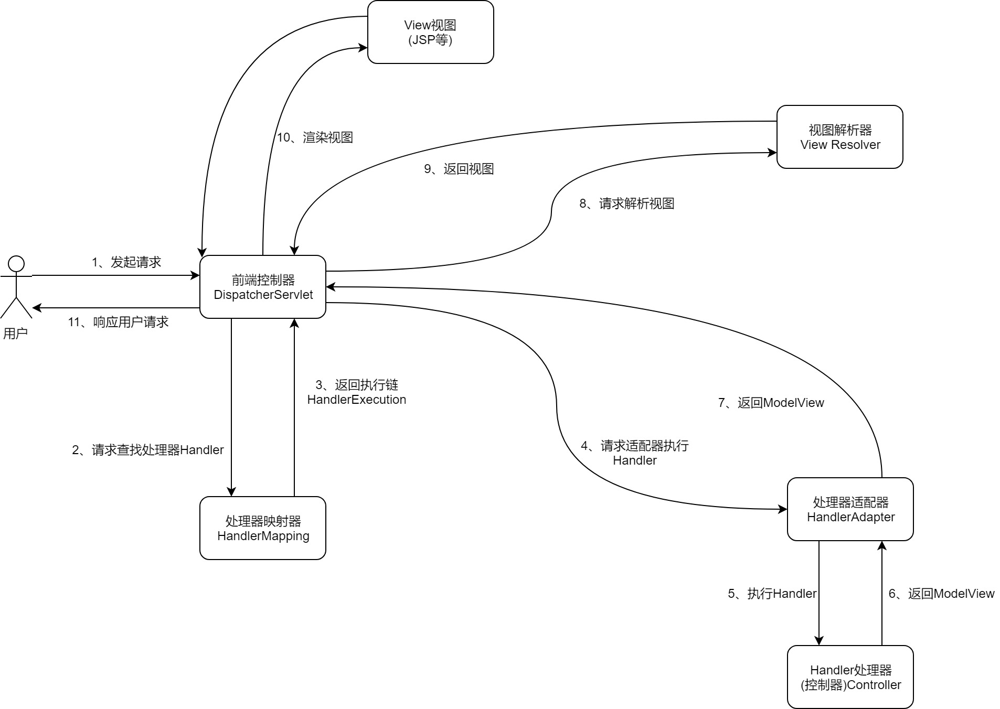

# Spring MVC

基于MVC架构模式的轻量级Web框架，目的是将Web开发模块化，对整体架构进行解耦

**优点**
- 作为Spring框架的一部分，拥有Spring的优点（IOC,AOP等）
- 支持灵活的URL到页面控制器的映射
- 提供灵活的数据验证、格式化、数据绑定机制
- 支持RESTful风格

## Spring MVC请求流程

**功能组件**
- 前端控制器(DispatcherServlet)：接收用户请求并返回请求结果。它的作用相当于一个转发器或中央处理器，控制整个执行流程，对各逐渐进行调度降低组件之间的耦合
- 处理器映射器(HandlerMapping)：根据用户请求的URL，通过注解或者XML配置，查找相应的处理器Handler
- 处理器适配(HandlerAdapter)：根据映射器查找出的Handler，完成调用处理器中的方法
- 处理器(Handler)：请求处理的具体逻辑，返回数据和视图信息
- 视图解析器(View Resolver)：解析具体视图，通过ModelAndView对象中的View信息，将逻辑视图名解析成真正的视图View
