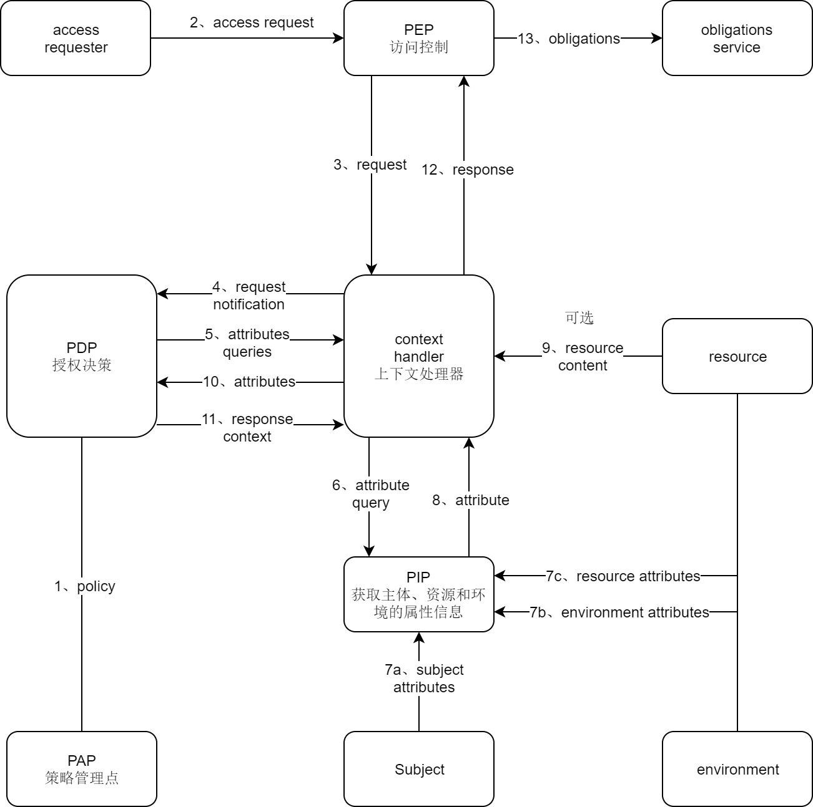
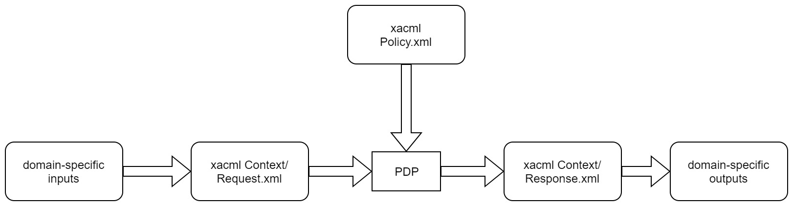

# eXtensible Access Control Markup Language (XACML) Version 3.0

## 介绍

### 术语

- Subject: 主体, 请求对某种资源执行某些动作的请求者
- Resource: 资源, 系统提供给请求者使用的数据、服务和系统组件
- Policy: 策略, 一组规则，规定主体对资源使用的一些要求，多个策略组合形成策略集(Policy Set)
- Policy Enforcement Point, PEP: 在一个具体的应用环境下执行访问控制的实体，将具体应用环境下访问控制请求转换为适应XACML要求的决策请求。
  然后根据决策请求的判决结果执行相应的动作，如允许用户请求和拒绝用户请求等
- Policy Decision Point, PDP: 系统中授权决策的实体，依据XACML描述的访问控制策略以及其他属性信息进行访问控制决策
- Policy Administration Point, PAP: 在系统中产生和维护安全策略的实体
- Policy Information Point, PIP: 通过它可以获取主体、资源和环境的属性信息的实体

## 背景

解决了什么问题

管理大企业的安全策略

### 要求
- 提供方法整合单独的rules和policies到一个策略集合中

### Rule和Policy的组合

对于特定的策略请求，一个完整的策略可能包含多个rules和policies。

XACML定义了3级策略元素：Rule、Policy、PolicySet

Rule：包含一个单独的布尔表达式，不意味着PDP的孤立的。仅在PAP中是孤立的。是构建policies的基本单元
Policy：包含一系列Rule和评估结果。是PDP的基本policy，是授权决策的基础
PolicySet：包含一系列Policy或其它PolicySet和评估结果

### 组合算法

XACML定义了许多可以分别由<Policy>或<PolicySet>元素的RuleCombiningAlgId或PolicyCombiningAlgId属性标识的组合算法

rule-combining algorithm：定义了在一组rule单独评估下获取授权决策的过程
policy-combining algorithm：定义了用于在给定一组策略的单独评估结果的情况下获得授权决策的过程

标准组合算法定义：
- Deny-overrides (Ordered and Unordered)：拒绝优先，如果有一个结果为 Deny，则组合结果为 Deny
- Permit-overrides (Ordered and Unordered)：许可优先，如果有一个结果为 Permit，则组合结果为 Permit
- First-applicable and：首先应用，组合结果与第一个Rule、Policy、PolicySet结果一样
- Only-one-applicable：唯一许可，只能应用在 policies，确保只有一个policy或policy set是许可的  
  如何没有应用在policy或policy set上，结果为 NotApplicable  
  如果超过一个policy或policy set是许可的，结果为 Indeterminate

> 如果需要需要定义自己的组合算法

### 多Subjects

### Policies based on subject and resource attributes

<AttributeDesignator URN >
<Content>

### 规则
规则（Rule）是策略语言中一个重要的基本元素  

规则包括3个组成部分，即目标（Target）、效用（Effect）和条件（Condition）

目标（Target）表示规则应用的对象，其中包括4个基本元素，即资源（Resource）、主体（Subject）、动作（Actions）和环境（Environment）。
一个目标的基本含义是主体对资源执行的某些动作，这些动作是在一定的环境下执行的。
在应用规则的时候，根据请求的主体、资源、动作，以及相关的环境因素来查找可以应用的规则  

效用表示规则应用后的结果，包括两个值，即许可（Permit）和拒绝（Deny）
效用的含义是如果某一个决策请求中的要素（包括主体、资源、动作和环境）和规则中的目标相同，并且效用是许可，则决策结果是许可；
如果效用是拒绝，则决策结果是拒绝。

## 模型

1. PAP录入policy或policy set到PDP中
2. 访问者访问PEP
3. PEP发生请求到context handler
4. context handler构建一个XACML请求上下文发送到PDP
5. PDP通过context handler请求额外subject、resource、action、environment、或其它类别属性
6. context handler 从PIP请求属性
7. PIP获取属性
8. PIP返回属性给context handler
9. (可选)context handler 在上下文中包含资源信息
10. context handler发送请求属性和资源(可选)给PDP。PDP执行policy
11. PDP返回响应上下文(包含授权决策)给context handler
12. context handler 转换请求上下文格式为PEP响应格式。context handler返回响应给PEP
13. PEP履行相应的义务
14. 如果访问是允许的，则PEP允许访问资源。否则拒绝访问

### XACML context

XACML适用于各种应用环境  

> The PDP is not required to operate directly on the XACML representation of a policy.  It may operate directly on an alternative representation.
